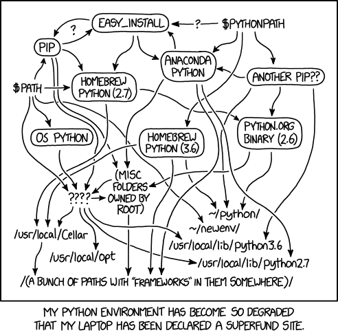

<section>
  <pre><code data-trim data-noescape>
+ What's a development environment?
+ Why should I care?
+ The "ideal" solution
  </code></pre>
  <a href="slides.html"><</a>
</section>
<section>
  <pre><code data-trim data-noescape>
# Development Environment
Software, tools and resources that will enable you to write, test, execute and share your automation code.

+ IDE vrs Text Editors
+ Programning Languages(s)
+ Source Control Management (SCM)
+ System Tools
+ Libraries / Packages

Wouldn't it be cool to have all of this in one package?
  </code></pre>
  <a href="slides.html"><</a>
</section>
<section>
  <pre><code data-trim data-noescape>
Why do we care?
  </code></pre>

  <a href="slides.html"><</a> 
</section>